This page is the demo of 
1. "Quasi-periodic parallel WaveGAN: a non-autoregressive raw waveform generative model with pitch-dependent dilated convolution neural networks" [[paper](https://arxiv.org/abs/2007.12955)] [[code](https://github.com/bigpon/QPPWG)]  
2. "Quasi-periodic parallel WaveGAN vocoder: a non-autoregressive pitch-dependent dilated convolution model for parametric speech generation" [[paper](https://arxiv.org/abs/2005.08654)] 

## **Abstract**  

 We propose a <b>Quasi-Periodic Parallel WaveGAN (QPPWG)</b> waveform generative model, which applies a quasi-periodic (QP) structure to a parallel WaveGAN (PWG) model using pitch-dependent dilated convolution networks (PDCNNs). PWG is a compact GAN-based raw waveform generative model, whose generation time is much faster than realtime because of its non-autoregressive (non-AR) and non-causal mechanisms. Although PWG achieves a high fidelity speech generation, the generic and simple network architecture lacks pitch-controllability for the unseen auxiliary pitches such as a scaled pitch. To improve the pitch and speech modeling capability, we apply a QP structure with PDCNNs to the generator of PWG, and it introduces pitch information to the network by dynamically changing the network architecture corresponding to the auxiliary pitches. 

**Corpus and references:**  
[VCC2018](http://www.vc-challenge.org/)  
[PWG](https://ieeexplore.ieee.org/abstract/document/9053795)  
[PWG_repo](https://github.com/kan-bayashi/ParallelWaveGAN)  
[QPNet](https://bigpon.github.io/QuasiPeriodicWaveNet_demo/)  

## **Architecture of PWG/QPPWG**  

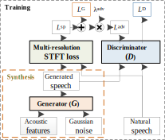

## **Generator of QPPWG**  

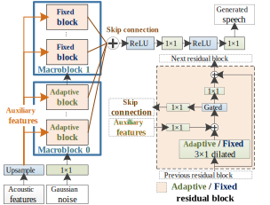
  
    
## **Non-AR PDCNN**  

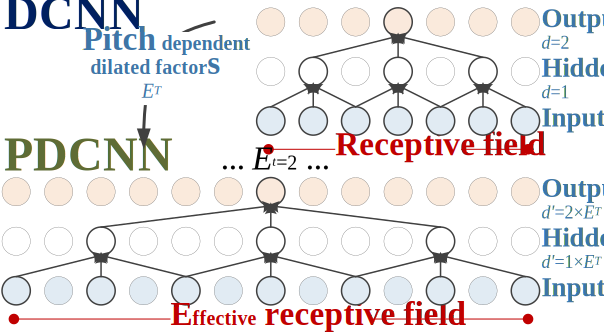
  
  
## **Demo Sounds**
- Conditioned on **1**&times;*F*0

| Vocoder                | Female (SF3)                                                                   | Male (SM3)                                                                     |
|:-----------------------|:------------------------------------------------------------------------------:|:------------------------------------------------------------------------------:|
| **Natural**            | <audio src="res/audio/SF3/Natural/30013.wav" controls preload></audio>         | <audio src="res/audio/SM3/Natural/30017.wav" controls preload></audio>         |
| WORLD *1    | <audio src="res/audio/SF3/1_0_F0/WORLD/30013.wav" controls preload></audio>    | <audio src="res/audio/SM3/1_0_F0/WORLD/30017.wav" controls preload></audio>    |
| QPNet *2    | <audio src="res/audio/SF3/1_0_F0/QPNet/30013.wav" controls preload></audio>    | <audio src="res/audio/SM3/1_0_F0/QPNet/30017.wav" controls preload></audio>    |
| PWG_30 *3   | <audio src="res/audio/SF3/1_0_F0/PWG_30/30013.wav" controls preload></audio>   | <audio src="res/audio/SM3/1_0_F0/PWG_30/30017.wav" controls preload></audio>   |
| PWG_20 *4   | <audio src="res/audio/SF3/1_0_F0/PWG_20/30013.wav" controls preload></audio>   | <audio src="res/audio/SM3/1_0_F0/PWG_20/30017.wav" controls preload></audio>   |
| QPPWG_20 *5 | <audio src="res/audio/SF3/1_0_F0/QPPWG_20/30013.wav" controls preload></audio> | <audio src="res/audio/SM3/1_0_F0/QPPWG_20/30017.wav" controls preload></audio> |
| PWG_16 *6   | <audio src="res/audio/SF3/1_0_F0/PWG_16/30013.wav" controls preload></audio>   | <audio src="res/audio/SM3/1_0_F0/PWG_16/30017.wav" controls preload></audio>   |
| QPPWG_16 *7 | <audio src="res/audio/SF3/1_0_F0/QPPWG_16/30013.wav" controls preload></audio> | <audio src="res/audio/SM3/1_0_F0/QPPWG_16/30017.wav" controls preload></audio> |

*1. `WORLD: Baseline I`   
*2. `QPNet: Baseline II`   
*3. `PWG_30: PWG vocoder with 30 fixed blocks`    
*4. `PWG_20: PWG vocoder with 20 fixed blocks`   
*5. `QPPWG_20: QPPWG vocoder with 10 adaptive blocks + 10 fixed blocks`   
*6. `PWG_16: PWG vocoder with 16 fixed blocks`   
*7. `QPPWG_16: QPPWG vocoder with 8 adaptive blocks + 8 fixed blocks`   
 
   
- Conditioned on **&frac12;**&times;*F*0

| Vocoder  | Female (SF3)                                                                   | Male (SM3)                                                                     |
|:---------|:------------------------------------------------------------------------------:|:------------------------------------------------------------------------------:|
| WORLD    | <audio src="res/audio/SF3/0_5_F0/WORLD/30013.wav" controls preload></audio>    | <audio src="res/audio/SM3/0_5_F0/WORLD/30017.wav" controls preload></audio>    |
| QPNet    | <audio src="res/audio/SF3/0_5_F0/QPNet/30013.wav" controls preload></audio>    | <audio src="res/audio/SM3/0_5_F0/QPNet/30017.wav" controls preload></audio>    |
| PWG_30   | <audio src="res/audio/SF3/0_5_F0/PWG_30/30013.wav" controls preload></audio>   | <audio src="res/audio/SM3/0_5_F0/PWG_30/30017.wav" controls preload></audio>   |
| PWG_20   | <audio src="res/audio/SF3/0_5_F0/PWG_20/30013.wav" controls preload></audio>   | <audio src="res/audio/SM3/0_5_F0/PWG_20/30017.wav" controls preload></audio>   |
| QPPWG_20 | <audio src="res/audio/SF3/0_5_F0/QPPWG_20/30013.wav" controls preload></audio> | <audio src="res/audio/SM3/0_5_F0/QPPWG_20/30017.wav" controls preload></audio> |
| PWG_16   | <audio src="res/audio/SF3/0_5_F0/PWG_16/30013.wav" controls preload></audio>   | <audio src="res/audio/SM3/0_5_F0/PWG_16/30017.wav" controls preload></audio>   |
| QPPWG_16 | <audio src="res/audio/SF3/0_5_F0/QPPWG_16/30013.wav" controls preload></audio> | <audio src="res/audio/SM3/0_5_F0/QPPWG_16/30017.wav" controls preload></audio> |
  
   
- Conditioned on **2**&times;*F*0

| Vocoder  | Female (SF3)                                                                   | Male (SM3)                                                                     |
|:---------|:------------------------------------------------------------------------------:|:------------------------------------------------------------------------------:|
| WORLD    | <audio src="res/audio/SF3/2_0_F0/WORLD/30013.wav" controls preload></audio>    | <audio src="res/audio/SM3/2_0_F0/WORLD/30017.wav" controls preload></audio>    |
| QPNet    | <audio src="res/audio/SF3/2_0_F0/QPNet/30013.wav" controls preload></audio>    | <audio src="res/audio/SM3/2_0_F0/QPNet/30017.wav" controls preload></audio>    |
| PWG_30   | <audio src="res/audio/SF3/2_0_F0/PWG_30/30013.wav" controls preload></audio>   | <audio src="res/audio/SM3/2_0_F0/PWG_30/30017.wav" controls preload></audio>   |
| PWG_20   | <audio src="res/audio/SF3/2_0_F0/PWG_20/30013.wav" controls preload></audio>   | <audio src="res/audio/SM3/2_0_F0/PWG_20/30017.wav" controls preload></audio>   |
| QPPWG_20 | <audio src="res/audio/SF3/2_0_F0/QPPWG_20/30013.wav" controls preload></audio> | <audio src="res/audio/SM3/2_0_F0/QPPWG_20/30017.wav" controls preload></audio> |
| PWG_16   | <audio src="res/audio/SF3/2_0_F0/PWG_16/30013.wav" controls preload></audio>   | <audio src="res/audio/SM3/2_0_F0/PWG_16/30017.wav" controls preload></audio>   |
| QPPWG_16 | <audio src="res/audio/SF3/2_0_F0/QPPWG_16/30013.wav" controls preload></audio> | <audio src="res/audio/SM3/2_0_F0/QPPWG_16/30017.wav" controls preload></audio> |
  
  

## **Subjective Results** 
- MOS results of speech quality  

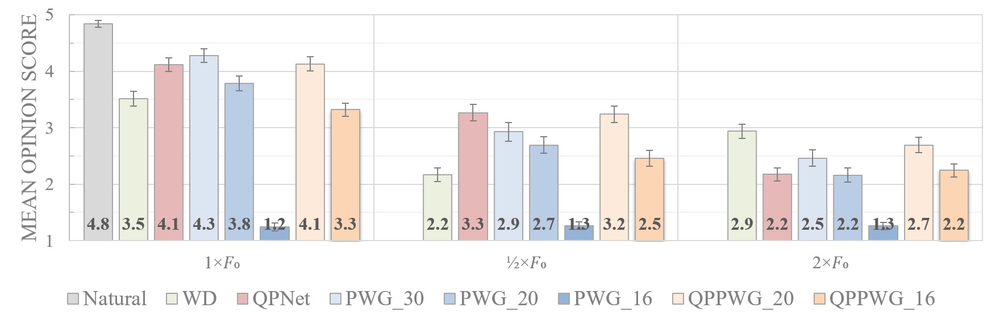
  
- XAB results of pitch accuracy  

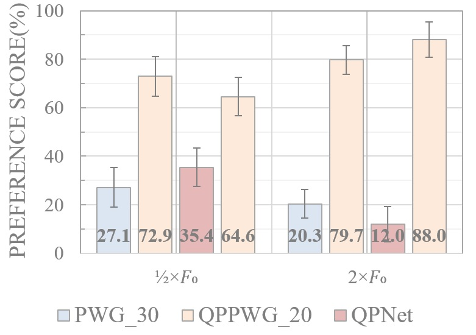

  
  

## **Visualized Intermediate Outputs** 

 Because the waveform outputs of the PWG/QPPWG models are the cumulative results of the skip connections from the residual blocks, the speech modeling behavior of the residual blocks can be explored via the visualized intermediate outputs of partial residual blocks. The following table shows the spectrograms of the intermediate outputs of the cumulative residual blocks. The results of PWG w/ 20 fixed blocks, QPPWG w/ 10 adaptive blocks + 10 fixed blocks (the demo system QPPWG_20), and QPPWG w/ 10 fixed blocks + 10 adaptive blocks are presented.
 

<table border="0">
  <tr>
  <td align="center"> <b>PWG</b> </td>
  <td align="center"> <b>QPPWG (adaptive->fixed)</b> </td>
  <td align="center"> <b>QPPWG (fixed->adaptive)</b> </td>
  </tr>
  <tr> <td colspan="3" align="center"> Conditioned on <b>1</b>&times;<i>F</i>0 </td> </tr>
  <tr>
  <td> 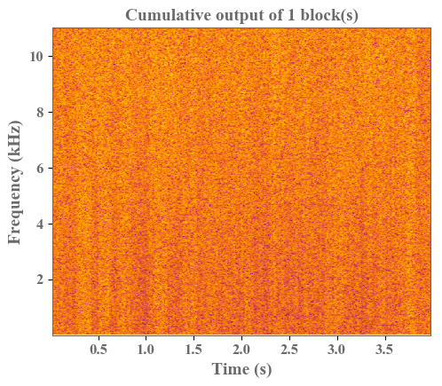 </td>
  <td> 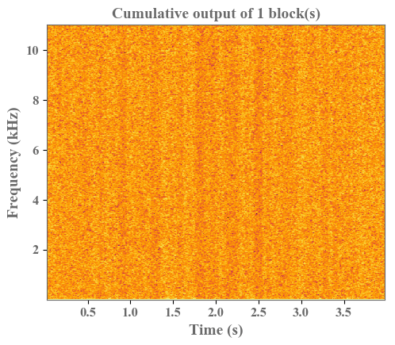 </td>
  <td> 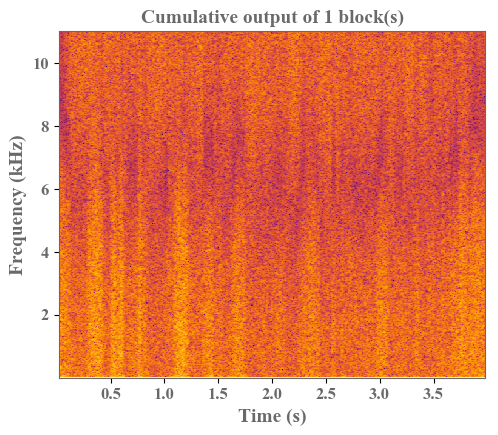 </td>
  </tr>
  <tr> <td colspan="3" align="center"> Conditioned on <b>&frac12;</b>&times;<i>F</i>0 </td> </tr>
  <tr>
  <td> 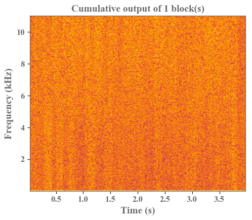 </td>
  <td> 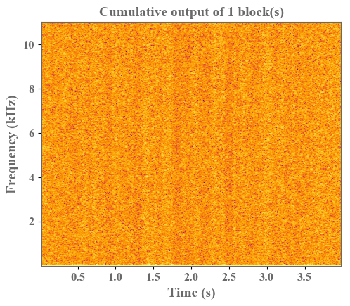 </td>
  <td> 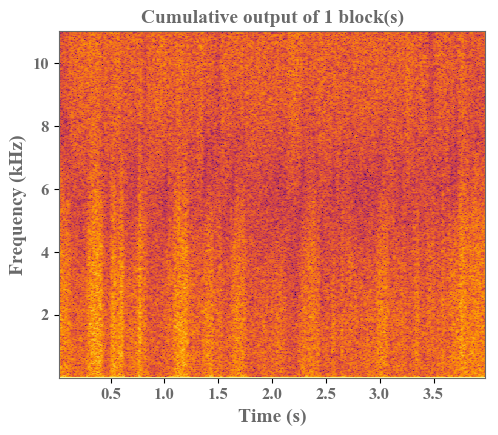 </td>
  </tr>
  <tr> <td colspan="3" align="center"> Conditioned on <b>2</b>&times;<i>F</i>0 </td> </tr>
  <tr>
  <td> 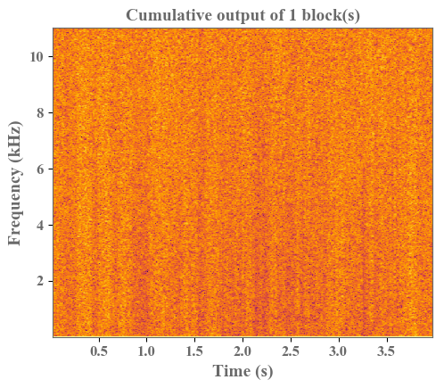 </td>
  <td>  </td>
  <td> 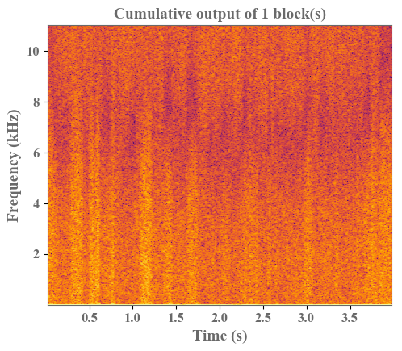 </td>
  </tr>
</table>

According to the results, we can find that
- **PWG**: spectrograms contain more harmonic and non-harmonic details as the number of the cumulative residual blocks increases. 
- **QPPWG (adaptive->fixed)**: the first ten adaptive blocks focus on modeling the harmonic components. 
- **QPPWG (fixed->adaptive)**: the first ten fixed blocks focus on modeling the the non-harmonic components.  

The results confirm our assumption that that the adaptive blocks with the PDCNNs primarily model the pitch-related speech components with the long-term correlations while the fixed blocks with the DCNNs mainly focus on the spectral-related speech components with the short-term correlations.

  
[Home](https://bigpon.github.io/)

   
   